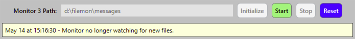
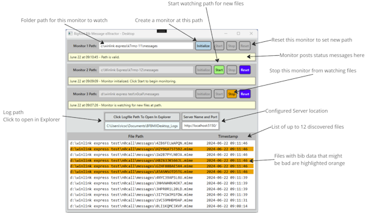
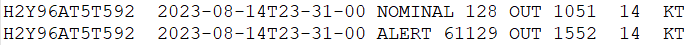

# Desktop App

## Install Desktop App

_Important!_ It is necessary to download and install [Windows Desktop Runtime 8.0.16 win x64](https://dotnet.microsoft.com/en-us/download/dotnet/8.0) when you have internet access and before installing the BF-BMX Desktop App. The Runtime is quick to download and install and can be removed at a later time by using the Windows "Add or Remove Programs" feature in Settings. This _only_ applies to the Desktop App.

Steps:

1. Download and install `Windows Desktop Runtime 8.0.16`
1. Locate and double-click "setup.exe" to start the installation process.
2. Follow the Installation Wizard prompts to complete installation.
3. The BF-BMX Desktop App will launch after installation.

> You can then find the app in the Windows Start Menu, named "BFBMX.Desktop".

## Desktop App Overview

The App is broken up into three main section: Monitors, Environment Variables, and Detected Files.

Monitors:

- Up to three directory monitors can be configured and used.
- Each monitor can be set to watch an valid Windows Directory, however you should point them to the "Messages" folder within Winlink Express installation directories.
- Monitors have buttons to `Initialize`, `Start`, and `Stop` monitoring.
- If necessary, the `Reset` button can be used to force an existing Monitor to stop and reset so it can be reconfigured.
- Monitor buttons are aware of Path Validity, and Monitor State, and they will automatically enable or disable as necessary.

Environment Variables:

- Logfile Path: The location that will contain the log files for the Desktop App, as configured by [Environment Variables](./README-EnvironmentVariables.md).
- Server, Port: The configured location of the remote server that will receive the discovered data, as configured by Environment Variables.

Detected Files:

- A scrollable list of `*.mime` files detected by any active Monitor.
- The list will hold a maximum of 12 items. New items are added to the top, and items are removed from the bottom (oldest).
- Files that contain Bib Report data that has malformed data or format will be highlighted for informational purposes.

## Set Desktop Monitor Paths

1. For each Winlink Express instance that you want to monitor, find the location of the `messages` folder. It is usually `c:\Winlink Express\<your_callsign>\Messages`.
1. Copy or type-in the path in the `Monitor 1 Path` textbox.
1. Press the `Tab` key to tell the app you are done entering the path.
1. If the path cannot be found, a warning will appear and none of that Monitor's buttons will be enabled.
1. Fix any errors in the path and click `Tab` again and the `Initialize` button should now be enabled.

## Start And Stop Desktop Monitors

Once a Monitor Path has a valid path entered and the `Initialize` button has been pressed, the `Start` and `Reset` buttons should become active.

- Start Button: Clicking this button will start the Monitor, which will look for newly created files in that Monitor's Path.
- Stop Button: Clicking this button will tell the Monitor to stop watching for newly created files in the Monitor Path. This is a courtesy feature to allow the Monitor to stop gracefully.
- Reset Button: This is a "hard stop" button that will stop and reset the Monitor to an unconfigured state.

_Note_: The primary purpose of the `Reset` button is to clear all memory of the Monitor before shutting down the Desktop App, but it can also be used if the Monitor is not behaving as expected and needs to be reconfigured and restarted.

## Review Desktop Log Files

The Desktop App displays the location of its log files as configured using [Environment Variables](./README-EnvironmentVariables.md).

Click on the location to open the directory in Windows Explorer, where you will see two logfiles appear as files are detected by the Desktop App:

- BFBMX Desktop App Log.
- Captured Bib Records log.

BFBMX Desktop App Log:

- The activities log are stored in a file named `bfbmx-desktop-app-log.txt`.
- Button clicks, discovered files, and discovered data events are all recorded in this log.
- A plain text file and can be opened with any text editor.
- The data format is: `yyyy-MMM-dd HH:mm:ss [INFO|WARN|ERROR]: {Module Member Name}: (a plain english explanation of Desktop Action or state information)`.

Captured Bib Records:

- The file is named `bfbmx-captured-bib-records.txt`.
- Discovered Bib Records are recorded here in a tab-delimited format, compatible with what the Server Service logs.
- The data format is: `[Winlink Message ID] [Message DateTime] [Data Warning Flag] [Bib Number] [Bib Action] [Bib Time] [Day Of Month] [Location Acronym]`.

The above example shows a Winlink Payload log entry: message ID H2Y96AT5T592 with a date-time stamp of 14-Aug-2023 at 11:31:00 AM (Local PDT) followed by Bib Record data (also in tabular format).

- The top Bib Record Data was parseable without issues so the Data Warning Flag was set to `NOMINAL`.
- The second Bib Record Data was _not_ directly parsable because the Bib Number was unexpectedly large. The App applied the Data Warning Flag of `ALERT` so the problem could be investigated and corrected by the computer operators.

_Note_: The exact same log file format is used by the Server Service and the Desktop App, with the exception that the Desktop App logs all Bib Records to a single file whereas the Server logs Bib Data in individual files, one file per Winlink Message ID.

## Desktop Log Entry Details

`INFO:` ...about Monitors Alpha, Bravo, and Charlie: These log entries can usually be ignored unless there is a problem with initializing, starting, or stopping a Monitor. Logged information will be adjusted in a future release to be less noisy and more helpful.

`INFO: Discovered file path {fullfilename} creation stamp {datetime} for processing.` and `INFO: Path {path} sent to screen for display`: When a file create event is detected the file information sent to the Desktop App UI.

`INFO: Sending file {fullfilename} created at {datetime} to file processor`: When a file create event is detected, the file contents are sent to the Matchers for processing.

`INFO: ProcessBibs: Found {Number} strict and {Number} relaxed matches in Message ID {Winlink ID}. Returning {Number} items.`: Helps the Desktop Operator understand how many Bib Records were found in the Winlink Message.

`INFO: Sending {Winlink Message ID} Message to logfile and API.`: Indicates the Bib Records were written to the Captured Bib Records log file and also sent to the Server service.

`INFO: Message ID {Winlink Message ID} => Wrote to file? {true or false}.`: Indicates if the Bib Records were written to the Captured Bib Records log file.

`INFO: Sending message to server at {BFBMX server api address}. Will timeout in 00:00:00 (HH:MM:SS)`: A response from the server is expected within a default timeout period of 20 seconds.

`WARN: Message ID {Winlink Message ID} was sent to server but there was no response or an error code was returned!`: No response from the server (there might be a problem if you launched a server locally or on another networked computer). This is set as a _WARN_ log message because a legitimate deployment scenario is to deploy BF-BMX Desktop only.

`WARN: IF A SERVER IS DEPLOYED AND YOU SEE THIS MESSAGE: ...`: You will need to do some troubleshooting to determine why the Desktop App cannot reach the Server Service. Check that the server is running, there are no host or network firewalls blocking the server port, and that the server and desktop computers are on the same network. If you are using a Security Software Suite, you might have to add the BF-BMX Desktop and/or BF-BMX Server to its "Allow list".

`INFO: Response from Server was a success status code.` and `Posted Message ID {Winlink Message ID} to API successfully`: The Winlink Message and its discovered Bib Records were successfully sent to the BF-BMX Server instance. These messages only appear if the prior _WARN_ messages are not present for the same Winlink Message ID. This is not necessarily a fatal error depending on your deployment scenario.

There are plenty of other log entries, but these are likely the most helpful in terms of resolving unexpected issues. Get used to reviewing the log files so you gain familiarity with their content and "what is normal".
