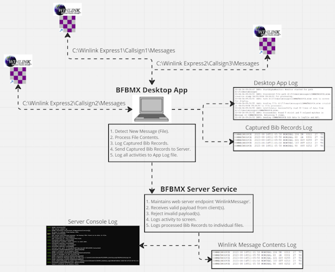

# Quick Start Guide for BF-BMX Operators

This guide consolidates the essential steps to install, configure, run, and manage BF-BMX components.

## Overall Achitecture

The BF-BMX architecture consists of the following components:

- Desktop: The desktop application for users to interact with the system.
- ServerApi: The backend API that handles requests from the desktop application.
- Reports: Provides a web interface for displaying database data (not pictured in diagram).
- Service: A group of related components supporting Desktop, Server, and Reports functions.

The architecture is modular and should run on any modern TCP/IP LAN or WiFi PAN:

- Desktop, ServerApi, and Reports server can run on the same computer or on separate computers.
- Desktop can run stand-alone or in conjunction with a ServerApi instance.
- Reports server **depends on** ServerApi to function, and cannot run without it.

*Note*: Firewall rules may need to be configured to allow communication between the components, especially if they are running on different computers. On occasion, it is necessary to edit WiFi/Router firewall rules, or PC firewall rules to "allow" the TCP Port number the ServerApi is configured to use.

## Configure, Install, Run, Manage Overview

Steps for success:

1. Configure environment: See [Configuration](#environment-configuration) section.
1. Install ServerAPI: See [ServerApi](#serverapi) section.
1. Install Desktop App: See [Desktop](#desktop) section.
1. Install Reports server: See [Reports](#reports-server) section.
1. Manage Desktop App: See [Configure Desktop App Monitors](#manage-desktop) section.
1. Manage ServerApi: See [Manage ServerApi](#manage-serverapi) section.
1. Use Reports server: See [Using Reports Server](#using-reports-server) section.
1. Shut down: See [Shut Down](#shut-down) section.

## Environment Configuration

The Desktop, ServerApi, and Reports components require configuration of Environment Variables to function correctly. These variables are used to define paths, ports, and other settings necessary for the components to communicate and operate effectively.

Only set variable names and settings when necessary:

- BFBMX_DESKTOP_LOG_DIR: Enter an existing directory where you want the DESKTOP app to write logfiles. Default is `C:\Users\{username}\Documents\BFBMX_Desktop_Logs`
- BFBMX_SERVER_LOG_DIR: Enter an existing directory where you want the ServerApi to write logfiles. Default is `C:\Users\{username}\Documents\BFBMX_Server_Logs`
- BFBMX_SERVER_NAME: The Hostname or IPv4 address of the **ServerApi** computer. Default: `localhost`.
- BFBMX_SERVER_PORT: The TCP Port used to connect the ServerApi. Default: 5150.

There are also some Environment Variables that manage Report Server display behavior. See [README-Reports.md](./README-Reports.md) for more information.

Stand-Alone Example:

1. All components are installed on a single PC and communicate over localhost.
1. Do **not** configure any Environment Variable except for possibly BFBMX_SERVER_PORT to avoid a Port Conflict on 5150.

Distributed Example:

You have a Desktop instance on your PC that needs to report to ServerApi on another PC on the local network, and you have a custom folder where you want logfiles to be stored. Configure the following:

- ServerApi: BFBMX_SERVER_LOG_DIR (your custom directory). Only set BFBMX_SERVER_PORT if Port 5150 is already in use.
- Desktop: BFBMX_DESKTOP_LOG_DIR (your custom directory), BFBMX_SERVER_NAME (IPv4 address or hostname of "ServerApi" computer), BFBMX_SERVER_PORT (5150 or the custom port configured on the ServerApi computer).
- Reports: BFBMX_SERVER_NAME (the hostname or IP address of the ServerApi PC), BFBMX_SERVER_PORT (set to same as "ServerApi BFBMX_SERVER_PORT" variable, above). There is no logfile output customization on the reports server.

How to Set Environment Variables so they survive logout/restart:

1. Click Start and then Settings (or CTRL + X and then select Settings).
1. Left Nav Bar: Click System.
1. Right Content Listing: Click About (at the bottom of the list).
1. Click Advanced system settings to bring up the System Properties window.
1. Click Advanced tab.
1. Click button Environment Variables... (near the bottom).
1. There are two sections: User variables, and System variables.
1. Under System Variables click button New... to bring up the New System Variable window.
1. Type the Environment Variable name in the space to left of the equals sign.
1. Excluding quotation marks, copy or type the Variable value to the right of the equals sign.
1. Click OK.
1. Repeat steps 8-11 until all environment variable names and values have been entered.
1. Close the Environment Variables window and the System Properties window.

## ServerApi

The ServerApi is an ASP.NET Web Sevice with an in-memory database, and does not install like an application. Simply run it and it will start listening for requests from BFBMX Desktop and BFBMX Reports.

### API Configure and Run

Requirements:

- Windows 10 or 11
- The ability to set and change Environment Variables
- Administrator rights to set and change Windows Firewall rules (in some cases)

Configure Using Environment Variables:

- Port 5150 not already in use: Do not set BFBMX_SERVER_NAME or BFBMX_SERVER_PORT environment variables.
- Port 5150 already in use: Set BFBMX_SERVER_NAME to `localhost` and BFBMX_SERVER_PORT to a custom port number (e.g., 61234).

Run:

1. Extract the downloaded ZIP file to a new directory.
1. Double-click the file "BFBMX.ServerApi.exe" to run the server service.
1. If prompted to allow a port through the Windows Firewall, click "Allow access" to enable Server Api access.

A console window will open, and the ServerApi will start running. The console window will display log messages and status updates on a semi-regular basis, and when important events occur.

### Manage ServerApi

ServerAPI does the following:

- Listens for requests from the BF-BMX Desktop application and posts notices to the Console window when they happen.
- Occasionally posts the SERVER_LOG directory location to the Console window.
- Writes log data to the Console window and its log file in the configured SERVER_LOG directory.
- Writes a running log of processed Bib Reports to separate logfiles for external manipulation (for example: import into a spreadsheet application).

If the Console window disappears:

1. Check the latest log entry for evidence of a problem.
1. Verify ServerApi isn't still running by using the Task Manager (CTRL + SHIFT + ESC) to look for "BFBMX.ServerApi.exe" in the Processes tab.
1. Restart ServerAPI if it is not running, so that the Desktop and Reports components can communicate with it.

Note: The database is **in memory** and does not survive shutdown-restarts! In order to re-populate the database, an instance of the Desktop App will need to discover all the message files again. The simplest way to do this is to configure a Desktop App PC to point to the Server API, configure a Monitor to a newly created temporary directory, and then copy (**not move**) the necessary messages (by date and time) to a new directory and the Desktop App will re-discover and re-send the data to the ServerApi.

## Desktop

BF-BMX Desktop provides a UI for configuring and monitoring Winlink Express Email Files, and runs monitoring services that communicate with BF-BMX ServerApi when new Winlink Epress Messages are detected. Each BF-BMX Desktop instance can monitor up to 3 Winlink Express instances on a single PC.

### Desktop Configure and Install

Requirements:

- Windows 10 or 11
- The latest version of Winlink Express
- The ability to set and change Environment Variables
- Administrator rights to set and change Windows Firewall rules (in some cases)

Configure:

Follow instructions in [Configuration](#configuration) to set Environment Variables.

Install:

1. Extract the downloaded ZIP file to a new directory.
1. Open the extracted ZIP directory and dobule-click "setup.exe". **Do not run Setup.exe without extracting the ZIP file first.**
1. Follow the Installation Wizard prompts to complete the installation.
1. The installer will complain the Publisher is not verified. This is expected because a short-expiration Developer Certificate is in use.
1. The BF-BMX Desktop App will launch automatically.

The Desktop App will also install a shortcut to the Start Menu, named "BFBMX.Desktop".

### Manage Desktop

Monitors:

- Buttons are color-coded and will become available only in certain conditions, defined below.
- Configure at least one monitor by typing in a path to a Winlink Express messages directory.
- Initialize button only becomes active after a valid directory is set by pressing the Tab key.
- Once initialize in pressed, Start and Reset are enabled.
- Click Start to start monitoring the configured directory.
- Click Stop to stop monitoring the configured directory.
- Click Reset to reset the monitor and clear any errors or issues.
- Problems or state changes to any Monitor will be displayed in each Monitor's Status Area, just below the Monitor Path field.

Detected Files:

- Lists all detected files by up to 3 configured Monitors.
- Files where "bib report" data might be bad or poorly formatted will be highlighted orange, and will still be sent to the ServerApi for further processing.

Log Files:

- Log files are written to the directory specified by the Environment Variable `BFBMX_DESKTOP_LOG_DIR`.
- For quick access, click the Log Path to open the Directory in File Explorer.

## Reports Server

The Reports server provide a web interface for displaying data from the BF-BMX ServerApi. It is not installed like an application because it is a stand-alone web server. It allows users to view reports, generated from data provided by the BF-BMX Desktop application, using a common web browser.

### Reports Configure and Run

Requirements:

- Windows 10 or 11
- The latest modern browser such as Chrome, Firefox, or Edge
- The ability to set and change Environment Variables
- Administrator rights to set and change Windows Firewall rules (in some cases)

Configure:

Set the Server Name and Port **only if ServerApi is running on a different computer** than the Reports server. Follow instructions in [Configuration](#configuration) to set Environment Variables.

Run:

1. Extract the downloaded ZIP file to a new directory.
1. Double-click the file "BFBMX.Reports.exe" to run the web server.
1. Open your modern web browser and navigate to `http://{ServerApiAddress}:5151` (or the custom port you set in the Environment Variables).

Example: ServerApi is running on a separate computer on port 61234 at IPv4 address 192.168.0.4

- Set BFBMX_SERVER_NAME: 192.168.0.4
- Set BFBMX_SERVER_PORT: 61234

Example: ServerApi is running on the same computer as Reports server:

- No need to change any environment variables.

### Using Reports Server

See [README-Reports.md](./README-Reports.md) for more information on using the Reports server.

## Shut Down

To shut down the BF-BMX Desktop:

1. Click STOP button at each Monitor.
1. Click RESET button at each Monitor.
1. Click the X in the upper right corner of the Desktop App window to close it.

To shut down the BF-BMX ServerApi:

1. Click the X in the upper right corner of the ServerApi console window to close it.

To shut down the BF-BMX Reports server:

1. Click the X in the upper right corner of the Reports server console window to close it.
