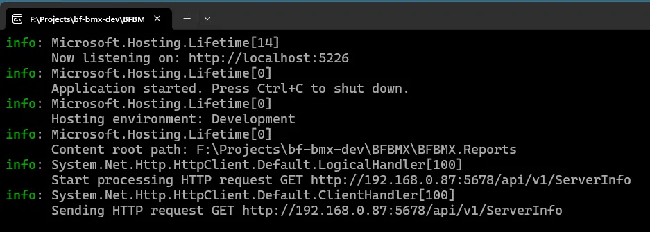
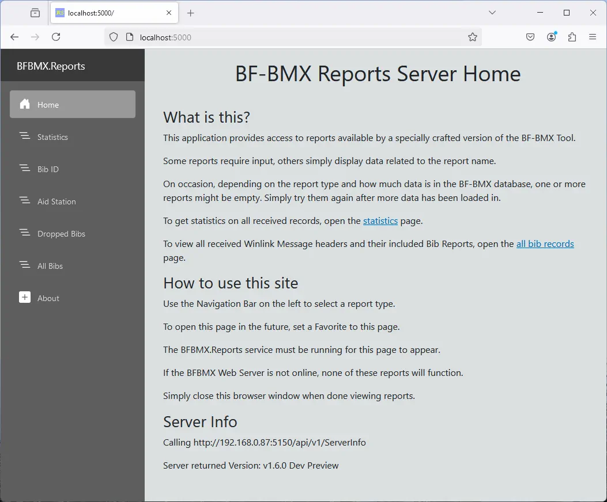

# Reports Server

Reports server supplies a web interface to view canned reports on bib information processed by the Server API.

## Support

Server:

- Dot NET 8.0 (included in the Server API executable and associated libraries)
- Modern browsers like Chrome, Firefox, and Edge

## Enivornment Variables

The following environment variables may be set for the Reports server:

- BFBMX_SERVER_NAME: The IPv4 address or hostname of the Server API (default is the local computername)
- BFBMX_SERVER_PORT: The port the Server API is configured to listen to (default 5150)
- BFBMX_BIGFOOT_BIBRANGE: The range of bib numbers to use for the reports (default is 1-299)
- BFBMX_40M_BIBRANGE: The range of bib numbers to use for the 40M reports (default is 300-599)
- BFBMX_20M_BIBRANGE: The range of bib numbers to use for the 20M reports (default is 600-999)

Current Limitations:

- The bib ranges _must not overlap_ or unexpected results may occur.
- There is not a way to define additional ranges, three is the maximum.
- To use a single range for an event, define a range for "BFBMX_BIGFOOT_BIBRANGE" that covers all event bib numbers, then assign out-of-range values to "BFBMX_40M_BIBRANGE" and "BFBMX_20M_BIBRANGE".
- There is not currently a way to define what port the Reports server uses.

## Configurations

Before running the Reports server, review these configuration options to ensure it can connect to the Server API.

Single Computer:

1. Install and run the Server API on the same computer as the Reports server.
1. Configure the Bib Range environment variables to match the bib numbers used in the event.
1. The Reports server will inherit BFBMX_SERVER_NAME and BFBMX_SERVER_PORT or their defaults.

Server API on separate computer:

1. Install and run the Server API on the other computer.
1. Configure the Bib Range environment variables to match the bib numbers used in the event.
1. Set the Reports server BFBMX_SERVER_NAME environment variable to the IPv4 address or hostname of the Server API computer.
1. Set the Reports server BFBMX_SERVER_PORT environment variable to the port the Server API is configured to listen to.

## Run

1. Configure environment variables according to [Configurations](#configurations), above.
1. Download and extract the Reports Server zip file.
1. Open the extracted folder and double-click "BFBMX.Reports.exe" to start the Reports server.
1. Open a web browser and navigate to `http://localhost:5000`.

## Usage

Reports server was designed to be simple to setup and use, providing canned reports using a simple web interface.

- How To Use This Site: Very succinct description of how to use the website.
- Server Info: Displays the server address and port and version number if available, otherwise reports an error.

Canned reports are accessed via the left-side navigation menu:

- Statistics: General statistics on reports from Aid Stations, processed records, total bibs seen, and more.
- Bib ID: Search any reported details on a specific Bib Number.
- Aid Station: Display Bib IDs and counts for a specific Aid Station.
- Dropped Bibs: List of all Bib IDs marked as DNF.
- All Bibs: List of all Bib IDs reported, with counts and details.

### Reports Server Console

### Reports Server Homepage

## Troubleshooting

If "Server Info" reports an error:

1. Check that ServerApi is running.
1. Ensure Server API IPv4 address is configured in Environment Variables (or not configured for some other computer on the network).
1. Check Server API port is configured in Environment Variables.
1. Confirm the Port is not already in use and a local or network Firewall is not blocking it.
1. Restart the Reports server and try again.
