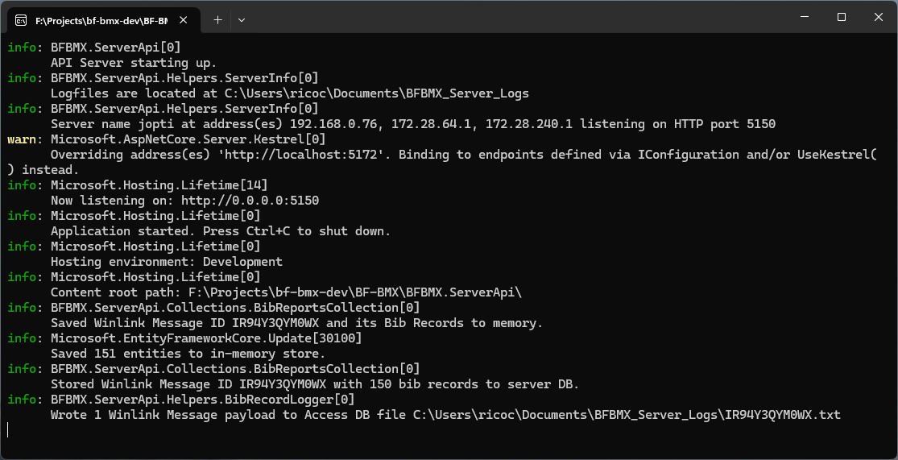

# ServerAPI aka Server Service

## Use the Server Service

The Server Service is a background service based on fully-fledge web components from Microsoft's `ASP.NET Core`:

- Only the necessary sub-components of ASP.NET Core are used to keep the service lightweight.
- Listens for JSON-formatted POST data via HTTP and processes data as it is received.
- Activities are logged to the console window that is opened when the service is started, and to a file stored in the `BFBMX_SERVER_LOG_DIR` folder.
- Bib Data received from the BFBMX Desktop Client(s) are logged to multiple tab-delimited files for reporting or other purposes.

_Note_: Version 2.1.1 includes a built-in SQLite DB storage mechanism.

## Run the Server Service

1. Download the latest ZIP file from the [Repository Releases Page](https://github.com/nojronatron/BF-BMX/releases)
1. Extract the contents to a folder on the Windows computer (for example the `Documents` folder or your `Desktop`).
1. Double-click `BFBMX.ServerApi.exe` to launch the service.
1. If an alert prompt appears from `Windows Firewall` or `Windows Security` click 'Allow Access' to enable the server to listen for incoming data from the Desktop App(s).
1. The console window will open and display the server's status, and activities.

_Note_: If the console window closes, simply double-click `BFBMX.ServerApi.exe` again to restart it.

## Server Service Overview

The Console Window:

- Use `CTRL` + `C` to _stop the server_. The BFBMX Server Service _will no longer listen for incoming data_ until it is restarted (this is a good reason to stop the Desktop Monitor(s) and probably Winlink Express, too).
- Use the scroll bar or a mouse wheel to scroll up and down the console window to review historical log detail.
- The console window can be changed in size to fit your needs without interrupting the server service in any way.
- Occasional log entries will display the server Hostname, IP Address(es), and HTTP Port.
- If the Console Window ever "disappears" that means the server service is no longer running and you will want to [restart it](#run-the-server-service).



_Note 1_: When first launched, the Server Service console might display one or more `warn` messages related to 'Microsoft.AspNetCore.Server.Kestrel[0]'. This is transitory and will not impact system operation or data processing.

_Note 2_: One of the goals of this software is to handle most issues without human intervention but it is not possible to anticipate every possibly error condition. Therefore, the Desktop App and Server operator(s) should be prepared to review log files and become adept at reviewing Log Files and using Winlink Express to help investigate and resolve issues.

The Log Files:

- A Winlink Message Logfile is created 1:1 for each Winlink Message payload the service receives.
- Each payload contains a Winlink Message ID, a Winlink Message DateTime stamp, and the Bib Data including the Warning Flag (all tab-delimited).
- Each file is named after the Winlink Message ID and is stored in the configured folder accorrding to [Environment Variables](./README-EnvironmentVariables.md).
- The data format is: `[Winlink Message ID] [Message DateTime] [Data Warning Flag] [Bib Number] [Bib Action] [Bib Time] [Day Of Month] [Location Abbreviation]`.


The above example shows a Winlink Payload log entry: message ID H2Y96AT5T592 with a date-time stamp of 14-Aug-2023 at 11:31:00 AM (Local PDT) followed by Bib Record data (also in tabular format).

- The top Bib Record Data was parseable without issues so the Data Warning Flag was set to `NOMINAL`.
- The second Bib Record Data was _not_ directly parsable because the Bib Number was unexpectedly large. The App applied the Data Warning Flag of `ALERT` so the problem could be investigated and corrected by the computer operators.

_Note_: The exact same log file format is used by the Server Service and the Desktop App, with the exception that the Desktop App logs all Bib Records to a single file whereas the Server logs Bib Data in individual files, one file per Winlink Message ID.

Server Activity Log:

- Writes activities to a file named `server_activity.txt`.
- Contains the same information that is displayed in the console window.
- Use this to review historical events of the Server, especially after an unexpected event like a crash or incorrect data processing.
- Displays the server's Hostname, HTTP Port, SQL DB activity, and Logfile location.

## Server Service Log Entry Details

- Most information written to the console window will be informational and prefixed with `info`.
- `warn` and `error` messages will be colored yellow or red, respectively. Pay attention to these and prepare to review the log files and originating Winlink Messages for possible issues.
- `info: Saved Winlink Message ID {ID} and its Bib Records to memory` and `info: Saved {number} entities to in-memory store.`: The server service received a valid Winlink Message "payload" and stored the data into memory.
- `Stored Winlink Message ID {ID} with {number} bib records to server DB.`: A built-in SQL database stores the information for quick retreival (and a future feature: querying).
- `Wrote 1 Winlink Message payload to Access DB file {fullfilepath}`: A new file was created and the tab-delimited bib record data was written to it. There will be 1 file for each unique Winlink ID the Server Service receives.
- `Logfiles are at {path}`: Reports the configured logfile location. Find the Bib Report output files here.
- `Server name {hostname} at address(es) {IPv4 Addresses} listening on HTTP port {TCP Port}`: The server is listening on the specified IPv4 Address and Port. The Desktop Operator will want this information when they configure Environment Variables.

If you see log entries that start with _WARN:_ you will want to interrogate the BF-BMX Server Activity logfile and the BF-BMX Desktop App Log file to diagnose if there is a problem.

## Server Service Database

- The database filename is set to `BFBMX-Messages.db`.
- DB data and transaction logfiles are stored in the local user's APPDATA dir: `$ENV:LOCALAPPDATA\BFBMX`

Use PowerShell to find the location of the database:

```powershell
ls $ENV:LOCALAPPDATA\BFBMX
```

Current Features:

- DB automatically initializes when DB file doesn't exist at start-up.
- Previously stored DB data can be cleared by simply removing the DB file when the Server Services _is not running_.
- To archive the DB, simply _move_ the `BFBMX-Messages.db` file to a different location.

Future features:

- Queryable Sqlite DB access from other clients.
- Set environment variable to change the DB file location.
