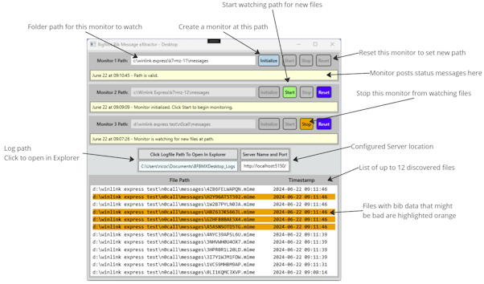
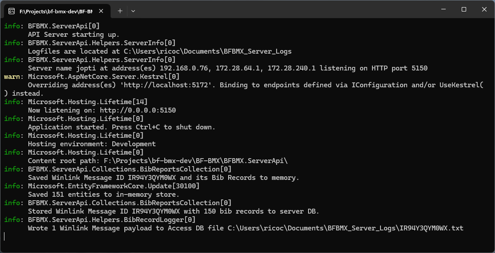

# Bigfoot Bib Message eXtractor aka BFBMX

The overarching goal of this project is to create a synchronization tool that will scrape Winlink Express messages for "Bigfoot Bib Data" and log that data to a central server computer for reporting on participant locations throughout the course.

## High Level Overview

- The "Bigfoot 200" by [Destination Trail](https://www.destinationtrailrun.com/) is a 200+ mile ultra trail marathon, located in the Gifford-Pinchot National Forest, in a 5-day event every summer. It is part of the "(in) famous triple crown" of 200-mile ultra marathon events.
- Ham radio operators from around the Pacific Northwest volunteer to support this event by providing logistical, tactical, and emergency communications alongside the event organizers and volunteers.
- Over time the hams have devised a digital messaging process using [Winlink Express](https://www.winlink.org), and programs like MS Excel and MS Access to report on runner locations from each Aid Station to Race Officials at the Finish Line.
- Managing the inflow of data at the Finish Line is a challenging task and a means to synchronize data collection from multiple Winlink Express instances is desireable, so that Finish Line hams can focus on reporting runner position data to race officials in a timely manner.

Each BFBMX Desktop component discovers Bib Records received via Winlink Express and sends them to a single "server" computer so that runner location and status information can be reported on quickly and easily, based on information submitted by each Aid Station ham radio operator.

## NEW - Web Reports Feature

A reporting service has been developed that acts as a front-end webpage for an operator to select a Bib Number, Aid Station, or other race criteria, and a report will be generated displaying data based on DB-stored data. Developed reports include:

- Aid Station: What bibs have been reported IN, OUT, and DROP, and when Winlink reports were received.
- All Bibs: Every bib entry as it was received via Winlink. Will include apparent duplicates due to same-bib numbers entering and leaving various aid stations, and dropping from the event.
- Bib Number: Specify a bib number to see what Winlink reports contained that bib record including timestamps and bib activities.
- Bib Statistics: An overall view of how many bib reports have been received, what bib numbers have been seen, etc.
- Dropped Bibs: A listing of bib reports that appear to have 'DROP' in the action field.

## Project Status

[Unreleased] Target Version 2.x.y:

- Upgrade Desktop and Server components to .NET 8.0
- Update NuGet packages.
- Add Quick Start Guide for operators as a separate document.
- Minor code improvements.

July 2024 Dev Preview 1.6.0:

- Update BFBMX Server Api to support RESTful report queries.
- Implement Report Server service.
- Tidy-up for deployment during August 2024 BigFoot event.

24-Jun-2024 Bugfix version 1.5.4:

- Refined Http Client settings to timeout after 20 seconds (instead of 90).
- Desktop Logging displays helpful WARNING log messages when Server is not reachable.

21-Jun-2024 Feature Update (target version 1.5.3):

- Highlight file records that have the 'Warning' flag set in the Desktop App UI.
- Minor bug fixes.

15-May-2024 version 1.4.3:

- Updated UI with a responsive display, contrasting color scheme, and updated control and content styles.
- Add updated images and facts to README and instructions.

13-May-2024 Bugfix version 1.3.3 Beta:

- Disallow initializing a Monitor with an empty or invalid path. A side-effect is there will no longer be an on-screen red error box when the path is invalid. However, the Monitor Status Message will indicate the problem on-screen.

7-May-2024:

- Added button to open logile in Explorer from Desktop UI.

6-May-2024:

- Added day and timestamp to Monitor Status Messages.
- Added 'server activity' log file that records Server console events to a file.
- Bib Records with malformed or missing Location are flagged 'ALERT' when processed.

29-Apr-2024:

- Added unit tests.
- Updated README with more detailed instructions on how to use the Desktop App and Server Service.
- Updated README to overview important logging entries and information.

27-Apr-2024:

- Server now logs detected local IP Addresses and Port to the console output.

26-Apr-2024:

- Changed Desktop Logging format from `dd-MM-yy-HH:mm:ss` (27-04-24-16:42:23) to `yyyy-MMM-dd HH:mm:ss` (2024-Apr-27 16:42:23), improving readability.

20-Apr-2024:

- Added support to detect comma-separated values in the BibRecord data.
- Squashed various tab-delim and comma-delim bugs in BibRecord matcher code.
- Updated logging and Monitor status messages to better track Monitor state and activities.
- Updated logging to better track discovered BibRecord data.
- Added Environment Variables to UI for easier recognition of configured settings.
- Removed backup/restore feature from the Server Service.
- Refactored BibRecord matcher code to be more lenient in certain conditions.
- BibRecord Data is now treated as immutabe.
- Logs will output Bib Time fields with leading zeros if less than 4 characters (like 24-hr time layout).
- BibRecords that are duplicated within same Message ID are not logged.
- BibRecords that are duplicate across Message IDs _are_ logged.
- Validated concurrent multi-directory monitoring in Debug and Release builds.
- Desktop running stand-alone (without server) runs without crashing or hanging the UI, and logs the fact that server does not respond.

10-Apr-2024:

- Added functional 3rd monitor.
- Updated Monitor Status Message content and behavior.
- Block configuring Monitors with duplicate file paths (although parent and child paths are allowed).
- Added checks to fend against edge-case Monitor states.
- Updated BibRecord detection pattern and processing.
- Rearranged BibRecord logging format to tab-delimited format (see [Review Desktop Log Files](#review-desktop-log-files) for details).
- Fixed concurrency bugs in Monitor processing.

5-Apr-2024:

- Added UI feature that displays latest detected file paths.

4-Apr-2024:

- Improved logging to capture more data server-side.
- Updated Environment Variables requirements for both client and server.

3-Mar-2024:

- Implemented tests and squashed bugs.
- Includes an exploratory models for later use in returning data from library to calling code.
- Includes exploratory ConcurrentQueue for possible use in displaying files found progress to the UI.

28-Feb-2024:

- Implemented early version of the server services (services in following bullet points).
- Implements use of Environment Variables for logging configuration.
- Server service logs server operations including error events, data or service warnings, and informational notes.
- Server service attempts to load a backup file to allow quickly resuming operations after a server restart or other failover requirements.
- POST Route receives data payload from client.
- GET Route enables anytime server data backup to a local JSON file.
- Logging manager logs incoming data to an auditing file.
- Logging manager stores bib data in expected format to a tab-delimited plain text file.
- Updated existing unit tests.
- Added unit tests for server-side implementations.

20-Feb-2024:

- Refactored data models for relational database storage and streamlined data transfer between client and server.
- Updated unit tests for new data models.
- Refactored bib data Regex matching to enable strict matching of bib data, and loose matching of possible bib data.
- Refactored file processing for enhance code testability and readability.

06-Feb-2024:

- Project design drawings underway.
- GitHub project initialized.

## Features and Components

Client App:

- Monitor up to three Winlink Express instances on a single PC.
- Log all "Bigfoot Bib Data" and note any possible data issues.
- Send data to a configured Server over the LAN or local wifi.
- Minimal UI, minimal necessary configuration needed.
- List discovered files so computer operator can easily keep tabs on current status.

Server Service:

- Listen for data from Client App(s) and process all incoming requests and payloads.
- Log all "Bigfoot Bib Data" and note any possible data issues with an additional "flag" bit.

## Target Environment And Dependencies

- Windows 10 or 11.
- The [.NET 6 Runtime](https://dotnet.microsoft.com/download/dotnet/6.0/runtime). You _must_ download and install this when you have internet access.
- The latest version of Winlink Express (to ensure mime-type compatibility). Also install this while you have internet access.
- A fully-connected wired or wireless LAN (internet access is only required to download software and use Telnet).
- If a Firewall/Router is involved, access to configuration might be necessary to allow HTTP traffic between client and server.

_Important Notes_:

- If your computer is missing any of these dependencies, you may need to have internet connectivity to install them.
- The .NET 6 Runtime _can_ be downloaded from the internet during Desktop App installation if you choose.
- Download and install the .NET 6 Runtime separately while you have internet access, prior to running the Desktop App installer for the best experience.
- Download and install Winlink Express separately while you have internet access, if it is not already installed and updated.

Operators must be able to:

- Run executables in a Windows environment.
- Navigate the Windows Filesystem.
- View plain-text logfile(s).
- Install, configure, and operate Winlink Express.

_Note_: It could be helpful to have experience with configuring Windows Firewall in case the Security Prompt during installation is not accepted or does not show.

### Additional Tools

- A capable text editor that can search and view extended ASCII characters, such as [Notepad++](https://notepad-plus-plus.org/).
- A Network Inspection tool like [Wireshark](https://www.wireshark.org/) to monitor HTTP traffic between client and server.
- Optional: A CSV- or Tab-delimited spreadsheet application such as MS Excel.

## Solution Design

BFBMX.Desktop:

- A Windows Desktop application that monitors up to three directories for mime-files containing specific formats of data.
- Application logs all activities and discovered data to a local log file.
- Application sends discovered data to the BFBMX.Server API.

BFBMX.ServerApi:

- A Windows Service that listens for incoming data from the BFBMX.Desktop application.
- Service logs all incoming data and activities to heads-up Terminal window.
- Service logs all incoming data to a local log file.
- Service has the ability to build-up a local database of data, for possible future use.

## How To Use

Usage instructions for BF-BMX Desktop App and Server Service.

1. Meet minimum requires as stated in [Target Environment And Dependencies](#target-environment-and-dependencies).
1. Configure [Local Environment Variables](#configure-local-environment-variables) to set behavior of the Desktop App and Server service.
1. Download the Desktop Zip File from the [Repository Releases Page](https://github.com/nojronatron/BF-BMX/releases) to the Windows computer that is running Winlink Express, and run the [installer](#install-desktop-app).
1. Copy the [Server Service](#run-the-server-service) zip folder to a location and un-zip it.
1. Make note of the `log location` presented in the [Server Service console output window](#server-service-overview)
1. _Leave the console window open_ so the server service continues to run.
1. Configure the Desktop App to monitor up to three directories where Winlink Express messages are stored, and `Start` the monitors.

## Configure Local Environment Variables

BFBMX will create a folder for its logfiles in the Documents folder of USERPROFILE with either Server or Desktop appended to the name, like:

- Desktop: `C:\Users\{username}\Documents\BFBMX_Desktop_Logs`
- Server: `C:\Users\{username}\Documents\BFBMX_Server_Logs`

BFBMX will also assume the Desktop and Server are running on the same machine on port `5150` unless you set Enivornment Variables.

Environment Variables that apply only to the Desktop App:

- `BFBMX_DESKTOP_LOG_DIR_`: Name of the folder where the Desktop App will store its log files. Recommend a name like "BFBMX_Desktop_Logs".

Environment Variables that apply only to the Server Service:

- `BFBMX_SERVER_LOG_DIR`: Name of the folder where the server will store log files. Recommend a name like "BFBMX_Server_Logs".

Environment Variables that apply to BOTH Desktop App and Server Service:

- `BFBMX_SERVER_NAME`: Name or IP address of server hosting the BF-BMX API. Use the server IPv4 address or `localhost` unless you know for certain a reliable name resolution service is available on your network.
- `BFBMX_SERVER_PORT`: The port that the BF-BMX API host is listening to. The default port is `5150` but the Server Operator might select another so check with them to verify before continuing.

How to Set Environment Variables so they survive logout/restart:

1. Click `Start` and then `Settings` (or `CTRL + X` and then select `Settings`).
1. Left Nav Bar: Click `System`.
1. Right Content Listing: Click `About` (at the bottom of the list).
1. Click `Advanced system settings` to bring up the `System Properties` window.
1. Click `Advanced` tab.
1. Click button `Environment Variables...` (near the bottom).
1. There are two sections: User variables, and System variables.
1. Under `System Variables` click button `New...` to bring up the New System Variable window.
1. Type the Environment Variable `name` in the space to left of the equals sign.
1. Excluding quotation marks, copy or type the Variable `value` to the right of the equals sign.
1. Click `OK`.
1. Repeat steps 8-11 until all environment variable names and values have been entered.
1. `Close` the Environment Variables window and the System Properties window.

The computer operator(s) can then start the BF-BMX Desktop application(s) and Server Service.

## Install Desktop App

1. Locate and double-click "setup.exe" to start the installation process.
2. Follow the Installation Wizard prompts to complete installation.
3. The BF-BMX Desktop App will launch after installation.

> You can then find the app in the Windows Start Menu, named "BFBMX.Desktop".

### Desktop App Overview

The App is broken up into three main section: Monitors, Environment Variables, and Detected Files.

Monitors:

- Up to three directory monitors can be configured and used.
- Each monitor can be set to watch an valid Windows Directory, however you should point them to the "Messages" folder within Winlink Express installation directories.
- Monitors have buttons to `Initialize`, `Start`, and `Stop` monitoring.
- If necessary, the `Reset` button can be used to force an existing Monitor to stop and reset so it can be reconfigured.
- Monitor buttons are aware of Path Validity, and Monitor State, and they will automatically enable or disable as necessary.

Environment Variables:

- Logfile Path: The location that will contain the log files for the Desktop App, as configured by [Environment Variables](#configure-local-environment-variables).
- Server, Port: The configured location of the remote server that will receive the discovered data, as configured by Environment Variables.

Detected Files:

- A scrollable list of `*.mime` files detected by any active Monitor.
- The list will hold a maximum of 12 items. New items are added to the top, and items are removed from the bottom (oldest).
- Files that contain Bib Report data that has malformed data or format will be highlighted for informational purposes.

### Set Up Desktop Monitor Paths

1. For each Winlink Express instance that you want to monitor, find the location of the `messages` folder. It is usually `c:\Winlink Express\<your_callsign>\Messages`.
1. Copy or type-in the path in the `Monitor 1 Path` textbox.
1. Press the `Tab` key to tell the app you are done entering the path.
1. If the path cannot be found, a warning will appear and none of that Monitor's buttons will be enabled.
1. Fix any errors in the path and click `Tab` again and the `Initialize` button should now be enabled.

### Start And Stop Desktop Monitors

Once a Monitor Path has a valid path entered and the `Initialize` button has been pressed, the `Start` and `Reset` buttons should become active.

- Start Button: Clicking this button will start the Monitor, which will look for newly created files in that Monitor's Path.
- Stop Button: Clicking this button will tell the Monitor to stop watching for newly created files in the Monitor Path. This is a courtesy feature to allow the Monitor to stop gracefully.
- Reset Button: This is a "hard stop" button that will stop and reset the Monitor to an unconfigured state.

_Note_: The primary purpose of the `Reset` button is to clear all memory of the Monitor before shutting down the Desktop App, but it can also be used if the Monitor is not behaving as expected and needs to be reconfigured and restarted.

### Review Desktop Log Files

The Desktop App displays the location of its log files as configured using [Environment Variables](#configure-local-environment-variables).

Click on the location to open the directory in Windows Explorer, where you will see two logfiles appear as files are detected by the Desktop App:

- BFBMX Desktop App Log.
- Captured Bib Records log.

BFBMX Desktop App Log:

- The activities log are stored in a file named `bfbmx-desktop-app-log.txt`.
- Button clicks, discovered files, and discovered data events are all recorded in this log.
- A plain text file and can be opened with any text editor.
- The data format is: `yyyy-MMM-dd HH:mm:ss [INFO|WARN|ERROR]: {Module Member Name}: (a plain english explanation of Desktop Action or state information).`.

Captured Bib Records:

- The file is named `bfbmx-captured-bib-records.txt`.
- Discovered Bib Records are recorded here in a tab-delimited format, compatible with what the Server Service logs.
- The data format is: `[Winlink Message ID] [Message DateTime] [Data Warning Flag] [Bib Number] [Bib Action] [Bib Time] [Day Of Month] [Location Acronym]`.

The above example shows a Winlink Payload log entry: message ID H2Y96AT5T592 with a date-time stamp of 14-Aug-2023 at 11:31:00 AM (Local PDT) followed by Bib Record data (also in tabular format).

- The top Bib Record Data was parseable without issues so the Data Warning Flag was set to `NOMINAL`.
- The second Bib Record Data was _not_ directly parsable because the Bib Number was unexpectedly large. The App applied the Data Warning Flag of `ALERT` so the problem could be investigated and corrected by the computer operators.

_Note_: The exact same log file format is used by the Server Service and the Desktop App, with the exception that the Desktop App logs all Bib Records to a single file whereas the Server logs Bib Data in individual files, one file per Winlink Message ID.

### Desktop Log Entry Details

`INFO:` ...about Monitors Alpha, Bravo, and Charlie: These log entries can usually be ignored unless there is a problem with initializing, starting, or stopping a Monitor. Logged information will be adjusted in a future release to be less noisy and more helpful.

`INFO: Discovered file path {fullfilename} creation stamp {datetime} for processing.` and `INFO: Path {path} sent to screen for display`: When a file create event is detected the file information sent to the Desktop App UI.

`INFO: Sending file {fullfilename} created at {datetime} to file processor`: When a file create event is detected, the file contents are sent to the Matchers for processing.

`INFO: ProcessBibs: Found {Number} strict and {Number} relaxed matches in Message ID {Winlink ID}. Returning {Number} items.`: Helps the Desktop Operator understand how many Bib Records were found in the Winlink Message.

`INFO: Sending {Winlink Message ID} Message to logfile and API.`: Indicates the Bib Records were written to the Captured Bib Records log file and also sent to the Server service.

`INFO: Message ID {Winlink Message ID} => Wrote to file? {true or false}.`: Indicates if the Bib Records were written to the Captured Bib Records log file.

`INFO: Sending message to server at {BFBMX server api address}. Will timeout in 00:00:00 (HH:MM:SS)`: A response from the server is expected within a default timeout period of 20 seconds.

`WARN: Message ID {Winlink Message ID} was sent to server but there was no response or an error code was returned!`: No response from the server (there might be a problem if you launched a server locally or on another networked computer). This is set as a _WARN_ log message because a legitimate deployment scenario is to deploy BF-BMX Desktop only.

`WARN: IF A SERVER IS DEPLOYED AND YOU SEE THIS MESSAGE: ...`: You will need to do some troubleshooting to determine why the Desktop App cannot reach the Server Service. Check that the server is running, there are no host or network firewalls blocking the server port, and that the server and desktop computers are on the same network. If you are using a Security Software Suite, you might have to add the BF-BMX Desktop and/or BF-BMX Server to its "Allow list".

`INFO: Response from Server was a success status code.` and `Posted Message ID {Winlink Message ID} to API successfully`: The Winlink Message and its discovered Bib Records were successfully sent to the BF-BMX Server instance. These messages only appear if the prior _WARN_ messages are not present for the same Winlink Message ID. This is not necessarily a fatal error depending on your deployment scenario.

There are plenty of other log entries, but these are likely the most helpful in terms of resolving unexpected issues. Get used to reviewing the log files so you gain familiarity with their content and "what is normal".

## Use the Server Service

The Server Service is a background service based on fully-fledge web components from Microsoft's `ASP.NET Core`:

- Only the necessary sub-components of ASP.NET Core are used to keep the service lightweight.
- Listens for JSON-formatted POST data via HTTP and processes data as it is received.
- Activities are logged to the console window that is opened when the service is started, and to a file stored in the `BFBMX_SERVER_LOG_DIR` folder.
- Bib Data received from the BFBMX Desktop Client(s) are logged to multiple tab-delimited files for reporting or other purposes.

### Run the Server Service

1. Download the latest ZIP file from the [Repository Releases Page](https://github.com/nojronatron/BF-BMX/releases) and extract the contents to a folder on the Windows computer (for example the `Documents` folder or your `Desktop`).
1. Double-click `BFBMX.ServerApi.exe` to launch the server service.
1. If an alert prompt appears from `Windows Firewall` or `Windows Security` click 'Allow Access' to enable the server to listen for incoming data from the Desktop App(s).
1. The console window will open and display the server's status and activities.

_Note_: To restart the service, simply double-click `BFBMX.ServerApi.exe` again.

### Server Service Overview

The Console Window:

- Use `CTRL` + `C` to _stop the server_. The BFBMX Server Service _will no longer listen for incoming data_ until it is restarted (this is a good reason to stop the Desktop Monitor(s) and probably Winlink Express, too).
- Use the scroll bar or a mouse wheel to scroll up and down the console window to review historical log detail.
- The console window can be changed in size to fit your needs without interrupting the server service in any way.
- Occasional log entries will display the server Hostname, IP Address(es), and HTTP Port.
- If the Console Window ever "disappears" that means the server service is no longer running and you will want to [restart it](#run-the-server-service).

_Note 1_: When first launched, the Server Service console might display one or more `warn` messages related to 'Microsoft.AspNetCore.Server.Kestrel[0]'. This is transitory and will not impact system operation or data processing.

_Note 2_: One of the goals of this software is to handle most issues without human intervention but it is not possible to anticipate every possibly error condition. Therefore, the Desktop App and Server operator(s) should be prepared to review log files and become adept at reviewing Log Files and using Winlink Express to help investigate and resolve issues.

The Log Files:

- A Winlink Message Logfile is created 1:1 for each Winlink Message payload the service receives.
- Each payload contains a Winlink Message ID, a Winlink Message DateTime stamp, and the Bib Data including the Warning Flag (all tab-delimited).
- Each file is named after the Winlink Message ID and is stored in the configured folder accorrding to [Environment Variables](#configure-local-environment-variables).
- The data format is: `[Winlink Message ID] [Message DateTime] [Data Warning Flag] [Bib Number] [Bib Action] [Bib Time] [Day Of Month] [Location Abbreviation]`.

The above example shows a Winlink Payload log entry: message ID H2Y96AT5T592 with a date-time stamp of 14-Aug-2023 at 11:31:00 AM (Local PDT) followed by Bib Record data (also in tabular format).

- The top Bib Record Data was parseable without issues so the Data Warning Flag was set to `NOMINAL`.
- The second Bib Record Data was _not_ directly parsable because the Bib Number was unexpectedly large. The App applied the Data Warning Flag of `ALERT` so the problem could be investigated and corrected by the computer operators.

_Note_: The exact same log file format is used by the Server Service and the Desktop App, with the exception that the Desktop App logs all Bib Records to a single file whereas the Server logs Bib Data in individual files, one file per Winlink Message ID.

Server Activity Log:

- Writes activities to a file named `server_activity.txt`.
- Contains the same information that is displayed in the console window.
- Use this to review historical events of the Server, especially after an unexpected event like a crash or incorrect data processing.

### Server Service Log Entry Details

- Most information written to the console window will be informational and prefixed with `info`.
- `warn` and `error` messages will be colored yellow or red, respectively. Pay attention to these and prepare to review the log files and originating Winlink Messages for possible issues.
- `info: Saved Winlink Message ID {ID} and its Bib Records to memory` and `info: Saved {number} entities to in-memory store.`: The server service received a valid Winlink Message "payload" and stored the data into memory.
- `Stored Winlink Message ID {ID} with {number} bib records to server DB.`: A built-in SQL database stores the information for quick retreival (and a future feature: querying).
- `Wrote 1 Winlink Message payload to Access DB file {fullfilepath}`: A new file was created and the tab-delimited bib record data was written to it. There will be 1 file for each unique Winlink ID the Server Service receives.
- `Logfiles are at {path}`: Reports the configured logfile location. Find the Bib Report output files here.
- `Server name {hostname} at address(es) {IPv4 Addresses} listening on HTTP port {TCP Port}`: The server is listening on the specified IPv4 Address and Port. The Desktop Operator will want this information when they configure Environment Variables.

If you see log entries that start with _WARN:_ you will want to interrogate the BF-BMX Server Activity logfile and the BF-BMX Desktop App Log file to diagnose if there is a problem.

## Notes and Limitations

- Data that _looks like a Bib Record_ according to the matching rules will be discovered, other data will not. It is not possible for this software to know if the data is correct or not, therefore it is up to the Desktop and Server operators to verify questionable data from the source.
- This software is designed to detect fairly-well formed tab- and comma-delimited data. Although _some variations_ like extra spaces etc will be detected and flagged, this software does _not try to detect every possible permutation of these 2 formats_.
- Conceivably, there are conditions under which this software may not detect a newly created file in a monitored folder. While the author has made every effort to minimize the liklihood this could happen, it is not outside the realm of possibility. It is up to the Desktop and Server operators to review log files to ensure data is being discovered and processed as expected.

## Timeline

- May 1st, 2024: Beta version will be made available to the Bigfoot Hams Coordinator for initial evaluation.
- May 2024: Beta version testing using 1 or more computers (no radios) begins in earnest and bugfixes or feature tweaks are applied when necessary.
- June 2024: Full end-to-end deployment that will test the software in a multi-computer, multi-Winlink Express deployment where all computers are connected via WiFi/wired LAN.
- July 2024: Official V1 published in time for the August 9th-13th event.
- After August 13th, 2024: Post-event review and feedback collection, and initial planning for V2 in 2025.

## References and Erratta

- [file-sync-win](https://github.com/nojronatron/file-sync-win).
- [Bigfoot-Bib-Report-WL-Form](https://github.com/nojronatron/Bigfoot-Bib-Report-WL-Form).
- Nojronatron has monetarily supported [Notepad++](https://notepad-plus-plus.org/) because he really likes and usees it daily.

## License

This software is licensed under the MIT License. See the [LICENSE](./LICENSE) file for details.

This README, the LICENSE file, and the following information _must be kept with this codebase:_

- Author: Nojronatron, copyright :copyright: Jon Rumsey, 2024.
- GitHub: [nojronatron](https://github.com/nojronatron).
- Repo: [BF-BMX on GitHub](https://github.com/nojronatron/BF-BMX).

