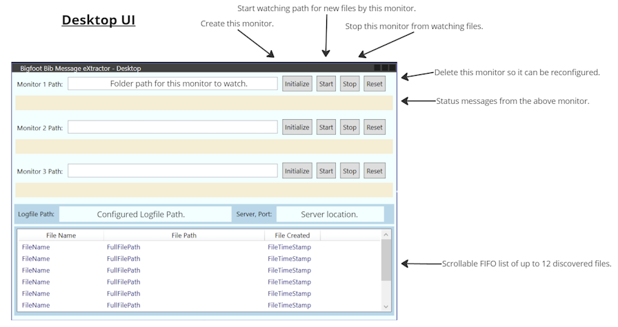
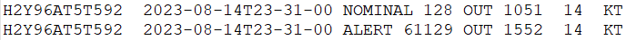

# Bigfoot Bib Message eXtractor aka BFBMX

The overarching goal of this project is to create a synchronization tool that will scrape Winlink Express messages for "Bigfoot Bib Data" and log that data to a central server computer for reporting on participant locations throughout the course.

## High Level Overview

- The "Bigfoot 200" by [Destination Trail](https://www.destinationtrailrun.com/) is a 200+ mile ultra trail marathon, located in the Gifford-Pinchot National Forest, in a 5-day event every summer. It is part of the "(in) famous triple crown" of 200-mile ultra marathon events.
- Ham radio operators from around the Pacific Northwest volunteer to support this event by providing logistical, tactical, and emergency communications alongside the event organizers and volunteers.
- Over time the hams have devised a digital messaging process using [Winlink Express](https://www.winlink.org), and programs like MS Excel and MS Access to report on runner locations from each Aid Station to Race Officials at the Finish Line.
- Managing the inflow of data at the Finish Line is a challenging task and a means to synchronize data collection from multiple Winlink Express instances is desireable, so that Finish Line hams can focus on reporting runner position data to race officials in a timely manner.

## Project Status

27-Apr-2024:

- Server now logs detected local IP Addresses and Port to the console output.

26-Apr-2024:

- Changed Desktop Logging format from `dd-MM-yy-HH:mm:ss` (27-04-24-16:42:23) to `yyyy-MMM-dd HH:mm:ss` (2024-Apr-27 16:42:23), improving readability.

20-Apr-2024:

- Added support to detect comma-separated values in the BibRecord data.
- Squashed various tab-delim and comma-delim bugs in BibRecord matcher code.
- Updated logging and Monitor status messages to better track Monitor state and activities.
- Updated logging to better track discovered BibRecord data.
- Added Environment Variables to UI for easier recognition of configured settings.
- Removed backup/restore feature from the Server Service.
- Refactored BibRecord matcher code to be more lenient in certain conditions.
- BibRecord Data is now treated as immutabe.
- Logs will output Bib Time fields with leading zeros if less than 4 characters (like 24-hr time layout).
- BibRecords that are duplicated within same Message ID are not logged.
- BibRecords that are duplicate across Message IDs _are_ logged.
- Validated concurrent multi-directory monitoring in Debug and Release builds.
- Desktop running stand-alone (without server) runs without crashing or hanging the UI, and logs the fact that server does not respond.

10-Apr-2024:

- Added functional 3rd monitor.
- Updated Monitor Status Message content and behavior.
- Block configuring Monitors with duplicate file paths (although parent and child paths are allowed).
- Added checks to fend against edge-case Monitor states.
- Updated BibRecord detection pattern and processing.
- Rearranged BibRecord logging format to tab-delimited format (see [Review Desktop Log Files](#review-desktop-log-files) for details).
- Fixed concurrency bugs in Monitor processing.

5-Apr-2024:

- Added UI feature that displays latest detected file paths.

4-Apr-2024:

- Improved logging to capture more data server-side.
- Updated Environment Variables requirements for both client and server.

3-Mar-2024:

- Implemented tests and squashed bugs.
- Includes an exploratory models for later use in returning data from library to calling code.
- Includes exploratory ConcurrentQueue for possible use in displaying files found progress to the UI.

28-Feb-2024:

- Implemented early version of the server services (services in following bullet points).
- Implements use of Environment Variables for logging configuration.
- Server service logs server operations including error events, data or service warnings, and informational notes.
- Server service attempts to load a backup file to allow quickly resuming operations after a server restart or other failover requirements.
- POST Route receives data payload from client.
- GET Route enables anytime server data backup to a local JSON file.
- Logging manager logs incoming data to an auditing file.
- Logging manager stores bib data in expected format to a tab-delimited plain text file.
- Updated existing unit tests.
- Added unit tests for server-side implementations.

20-Feb-2024:

- Refactored data models for relational database storage and streamlined data transfer between client and server.
- Updated unit tests for new data models.
- Refactored bib data Regex matching to enable strict matching of bib data, and loose matching of possible bib data.
- Refactored file processing for enhance code testability and readability.

06-Feb-2024:

- Project design drawings underway.
- GitHub project initialized.

## Planned V.1.0 Features and Components

Client App:

- Monitor up to three Winlink Express instances on a single PC.
- Log all "Bigfoot Bib Data" and note any possible data issues.
- Send data to a configured Server over the LAN or local wifi.
- Minimal UI, minimal necessary configuration needed.
- List discovered files so computer operator can easily keep tabs on current status.

Server Service:

- Listen for data from Client App(s) and process all incoming requests and payloads.
- Log all "Bigfoot Bib Data" and note any possible data issues with an additional "flag" bit.

## Target Environment And Dependencies

- Windows 10 or 11.
- The latest stable .NET 6 Runtime.
- The latest version of Winlink Express (to ensure mime-type compatibility).
- A fully-connected wired or wireless LAN.
- If a Firewall/Router is involved, access to configuration might be necessary to allow HTTP traffic between client and server.

Operators must be able to:

- Run executables in a Windows environment.
- Navigate the Windows Filesystem.
- View plain-text logfile(s).
- Configure Windows Firewall to allow HTTP communications between client and server.
- Install, configure, and operate Winlink Express.

### Additional Tools

- A capable text editor that can search and view extended ASCII characters, such as [Notepad++](https://notepad-plus-plus.org/).
- A Network Inspection tool like [Wireshark](https://www.wireshark.org/) to monitor HTTP traffic between client and server.
- Optional: A CSV- or Tab-delimited spreadsheet application such as MS Excel.

## Solution Design

BFBMX.Desktop:

- A Windows Desktop application that monitors up to three directories for mime-files containing specific formats of data.
- Application logs all activities and discovered data to a local log file.
- Application sends discovered data to the BFBMX.Server API.

BFBMX.ServerApi:

- A Windows Service that listens for incoming data from the BFBMX.Desktop application.
- Service logs all incoming data and activities to heads-up Terminal window.
- Service logs all incoming data to a local log file.
- Service has the ability to build-up a local database of data, for possible future use.

## How To Use

Usage instructions for BF-BMX Desktop App and Server Service.

1. Meet minimum requires as state in [Target Environment And Dependencies](#target-environment-and-dependencies).
1. Configure [Local Environment Variables](#configure-local-environment-variables) to set behavior of the Desktop App and Server service.
1. Download the ClickOnce :tm: [installer](#install-desktop-app) to the Windows computer that is running Winlink Express, and run the installer (link to published files is TBD).
1. Copy the [Server Service](#run-the-server-service) zip folder to a location and un-zip it.
1. Make note of the `log location` presented in the [Server Service console output window](#server-service-overview) and _do not_ close the window.
1. Make note of the `logfile path` that is presented in the [console window](#server-service-overview). This is where you will find logs of actions and discovered data in the Windows file system.

## Configure Local Environment Variables

BFBMX will create a folder for its logfiles in the Documents folder of USERPROFILE, for example:

C:\Users\username\Documents

Environment Variables that apply only to the Server Service:

- `BFBMX_BACKUP_FILE_NAME` = Filename to store server data entries as readable JSON. Recommend a name like: "BFBMX-LocalDb-Backup.txt"
- `BFBMX_SERVER_FOLDER_NAME` =  Name of the folder where the server will store various other log files. Recommend a name like: "BFBMX_Server_Logs"

Environment Variables that apply to BOTH Desktop App and Server Service:

- `BFBMX_FOLDER_NAME` = Name of the folder where the Desktop App will store its log files. Recommend a name like: "BFBMX_Desktop_Logs"
- `BFBMX_SERVERNAME` = Name or IP address of server hosting the BF-BMX API. The server name or IP _must_ be accessible as `localhost` if local, or by an IP Address if remote (hostname if DNS is available on the network).
- `BFBMX_SERVERPORT` = The port that the BF-BMX API host is available on. Default port is `5150`. Check with the server computer operator to confirm correct port number configuration.

How to Set Environment Variables so they survive logout/restart:

1. Click `Start` and then `Settings` (or `CTRL + X` and then select `Settings`).
2. Left Nav Bar: Click `System`.
3. Right Content Listing: Click `About` (at the bottom of the list).
4. Click `Advanced system settings` to bring up the `System Properties` window.
5. Click `Advanced` tab.
6. Click button `Environment Variables...` (near the bottom).
7. There are two sections: User variables, and System variables.
8. Under `System Variables` click button `New...` to bring up the New System Variable window.
9. Type the Environment Variable `name` in the space to left of the equals sign.
10. Excluding quotation marks, copy or type the Variable `value` to the right of the equals sign.
11. Click `OK`.
12. Repeat steps 8-11 until all environment variable names and values have been entered.
13. `Close` the Environment Variables window and the System Properties window.

The computer operator(s) can then start the BF-BMX Desktop application(s) and Server Service.
## Install Desktop App

Locate and double-click "setup.exe" to start the installation process.

The BF-BMX Desktop App will be installed and will launch.

As you might expect, you can find the app in the Windows Start Menu, named "BFBMX.Desktop".

### Desktop App Overview

The App is broken up into three main section: Monitors, Environment Variables, and Detected Files.

Monitors:

- Up to three monitors can be configured and used. Each monitor can be configured to monitor a specific Winlink Express instance.
- Monitors have buttons to `Initialize`, `Start`, and `Stop` monitoring. If necessary, the `Reset` button can be used to force an existing Monitor to stop and be reconfigured.
- Monitor buttons are aware of Path Validity, and Monitor State, and will automatically enable or disable as necessary.

Environment Variables:

- Logfile Path: The location that will contain the log files for the Desktop App.
- Server, Port: The configured location of the remote server that will receive the discovered data.

Detected Files:

- This is a scrolling, first-in-first-out list of files that any Started Monitors have detected.
- The list will hold a maximum of 12 items, and will remove the oldest item when a new one is added.

### Set Up Desktop Monitor Paths

1. For each Winlink Express instance that you want to monitor, find the location of the `messages` folder. It is usually `c:\Winlink Express\<your_callsign>\Messages`.
1. Copy or type-in the path in the `Monitor 1 Path` textbox. Press the `Tab` key to tell the app you are done entering the path.
1. If the path cannot be found, a warning will appear and none of that Monitor's buttons will be enabled. Fix the path and click `Tab` again and the `Initialize` button should now be enabled.

### Start And Stop Desktop Monitors

Once a Monitor Path has a valid path entered and the `Initialize` button has been pressed, the `Start` and `Reset` buttons should become active.

- Start Button: Clicking this button will start the Monitor, which will look for newly created files in the Monitor Path.
- Stop Button: Clicking this button will tell the Monitor to stop watching for newly created files in the Monitor Path. The Monitor can be told to watch for new files again by clicking the `Start` button.
- Reset Button: This is a "hard stop" button that will stop and reset the Monitor to an unconfigured state.
 
_Note_: The primary purpose of the `Reset` button is to clear all memory of the Monitor before shutting down the Desktop App, but it can also be used if the Monitor is not behaving as expected and needs to be reconfigured and restarted.

### Review Desktop Log Files

The Desktop App displays the location of its log files to the `Logfile Path` location.

2 logs are maintained here:

- BFBMX Desktop App Log.
- Captured Bib Records log.

BFBMX Desktop App Log:

- The activities log are stored in a file named `bfbmx-desktop-app-log.txt`.
- Button clicks, discovered files, and discovered data events are all recorded in this log.
- A plain text file and can be opened with any text editor.
- The data format is: `yyyy-MMM-dd HH:mm:ss [INFO|WARN|ERROR]: {Module Member Name}: (a plain english explanation of Desktop Action or state information).`.

Captured Bib Records:

- The file is named `bfbmx-captured-bib-records.txt`.
- Discovered Bib Records are recorded here in a tab-delimited format, compatible with what the Server Service logs.
- The data format is: `[Winlink Message ID] [Message DateTime] [Data Warning Flag] [Bib Number] [Bib Action] [Bib Time] [Day Of Month] [Location Acronym]`.

The above example shows a Winlink Payload log file, message ID H2Y96AT5T592 with a date-time stamp of 14-Aug-2024 at 11:31:00 AM:

- The top Bib Record Data was parseable without issues so the Data Warning Flag was set to `NOMINAL`.
- The second Bib Record Data was _not_ directly parsable. In this case the Bib Number was unexpectedly large, so the Data Warning Flag was set to `ALERT` so the problem could be investigated and corrected by the computer operator.

_Note_: The exact same log file format is used by the Server Service and the Desktop App, with the exception that the Desktop App logs all Bib Records to a single file, and the Server Service logs Bib Data in individual files, one file per Winlink Message ID.

## Use the Server Service

The Server Service is a background service based on fully-fledge web components in `ASP.NET Core`:

- Only the necessary sub-components of ASP.NET Core are used to keep the service lightweight.
- Actitivites are logged to the console window that is opened when the service is started.
- Bib Data received from the BFBMX Desktop Client(s) ared logged to multiple tab-delimited file for reporting or other purposes.

### Run the Server Service

1. Download the ZIP file (location TBD) and extract the contents to a folder on the Windows computer (for example the `Documents` folder or your `Desktop`).
1. Double-click `BFBMX-Server-Api.exe` to launch the server service.
1. If the Windows Firewall prompt appears, click 'Allow Access' to enable the server to listen for incoming data from the Desktop App(s).
1. The console window will open and display the server's status and activities.

### Server Service Overview

The Console Window:

- Use `CTRL` + `C` to stop the server. This will also close the console window and the BFBMX Desktop Application(s) will no longer have a server to send data to.
- Use the scroll bar or a mouse wheel to scroll up and down the console window to review past activities.
- The console window can be changed in size to fit your needs without interrupting the server service in any way.
- Most information written to the console window will be informational, but warnings and errors will be highlighted in yellow and red, respectively.
- Occasional log entries will display the server Hostname, IP Address(es), and HTTP Port.

The Log Files:

- The file is created 1:1 for each Winlink Message "payload" received.
- Each payload contains: A Winlink Message ID, a Winlink Message DateTime stamp, a BFBMX Desktop Computername, and the Bib Data including the Warning Flag.
- Each file is named after the Winlink Message ID, and is stored in the configured folder accorrding to [Environment Variables](#configure-local-environment-variables).
- The data format is: `[Winlink Message ID] [Message DateTime] [Data Warning Flag] [Bib Number] [Bib Action] [Bib Time] [Day Of Month] [Location Acronym]`.

The above example shows a Winlink Payload log file, message ID H2Y96AT5T592 with a date-time stamp of 14-Aug-2024 at 11:31:00 AM:

- The top Bib Record Data was parseable without issues so the Data Warning Flag was set to `NOMINAL`.
- The second Bib Record Data was _not_ directly parsable. In this case the Bib Number was unexpectedly large, so the Data Warning Flag was set to `ALERT` so the problem could be investigated and corrected by the computer operator.

_Note_: The exact same log file format is used by the Server Service and the Desktop App, with the exception that the Desktop App logs all Bib Records to a single file, and the Server Service logs Bib Data in individual files, one file per Winlink Message ID.

## Notes and Limitations

- Data that _looks like a Bib Record_ according to the matching rules will be discovered, other data will not. It is not possible for this software to know if the data is correct or not, therefore it is up to the Desktop and Server operators to verify questionable data from the source.
- This software is designed to detect fairly-well formed tab- and comma-delimited data. Although _some variations_ like extra spaces etc will be detected and flagged, this software does _not try to detect every possible permutation of these 2 formats_.
- Conceivably, there are conditions under which this software may not detect a newly created file in a monitored folder. While the author has made every effort to minimize the liklihood this could happen, it is not outside the realm of possibility. It is up to the Desktop and Server operators to review log files to ensure data is being discovered and processed as expected.

## Timeline

- May 1st, 2024: Beta version will be made available to the Bigfoot Hams Coordinator for testing and evaluation.
- Before end of July 2024: Official v.1 release published, in time for the August 9th-13th event.

## References and Erratta

- [file-sync-win](https://github.com/nojronatron/file-sync-win).
- [Bigfoot-Bib-Report-WL-Form](https://github.com/nojronatron/Bigfoot-Bib-Report-WL-Form).
- Nojronatron has monetarily supported [Notepad++](https://notepad-plus-plus.org/) because he really likes and usees it daily.
