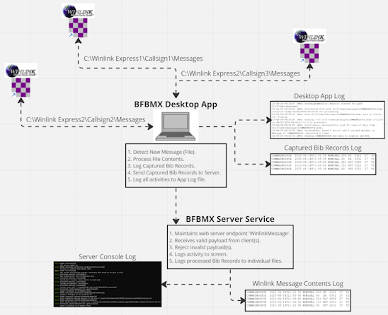
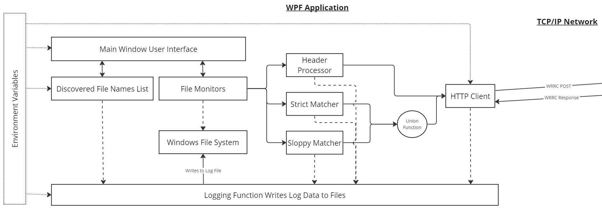
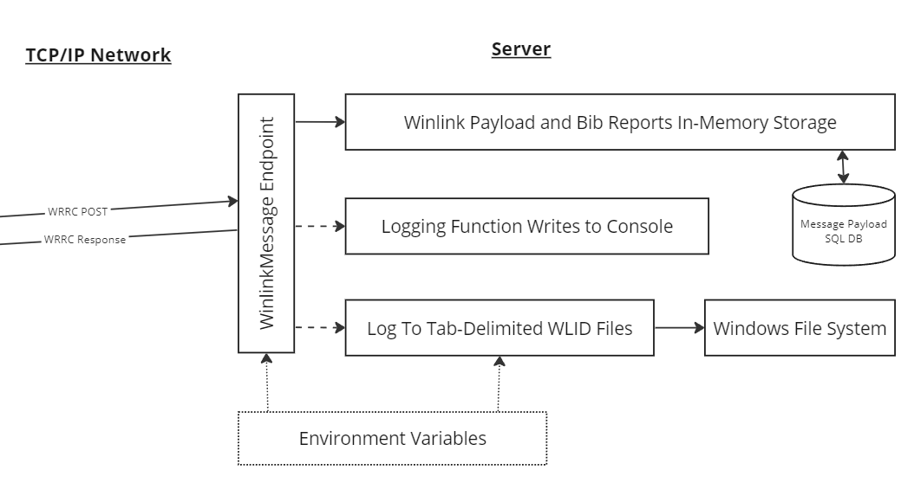

# Bigfoot Bib Message eXtractor aka BFBMX

The overarching goal of this project is to create a synchronization tool that will scrape Winlink Express messages for "Bigfoot Bib Data" and log that data to a central server computer for reporting on participant locations throughout the course.

## High Level Overview

- The "Bigfoot 200" by [Destination Trail](https://www.destinationtrailrun.com/) is a 200+ mile ultra trail marathon, located in the Gifford-Pinchot National Forest, in a 5-day event every summer. It is part of the "(in) famous triple crown" of 200-mile ultra marathon events.
- Ham radio operators from around the Pacific Northwest volunteer to support this event by providing logistical, tactical, and emergency communications alongside the event organizers and volunteers.
- Over time the hams have devised a digital messaging process using [Winlink Express](https://www.winlink.org), and programs like MS Excel and MS Access to report on runner locations from each Aid Station to Race Officials at the Finish Line.
- Managing the inflow of data at the Finish Line is a challenging task and a means to synchronize data collection from multiple Winlink Express instances is desireable, so that Finish Line hams can focus on reporting runner position data to race officials in a timely manner.

Each BFBMX Desktop component discovers Bib Records received via Winlink Express and sends them to a single "server" computer so that runner location and status information can be reported on quickly and easily, based on information submitted by each Aid Station ham radio operator.

## NEW - Web Reports Feature

A reporting service has been developed that acts as a front-end webpage for an operator to select a Bib Number, Aid Station, or other race criteria, and a report will be generated displaying data based on DB-stored data. Developed reports include:

- Aid Station: What bibs have been reported IN, OUT, and DROP, and when Winlink reports were received.
- All Bibs: Every bib entry as it was received via Winlink. Will include apparent duplicates due to same-bib numbers entering and leaving various aid stations, and dropping from the event.
- Bib Number: Specify a bib number to see what Winlink reports contained that bib record including timestamps and bib activities.
- Bib Statistics: An overall view of how many bib reports have been received, what bib numbers have been seen, etc.
- Dropped Bibs: A listing of bib reports that appear to have 'DROP' in the action field.

Review [BFBMX Reports README](./README-Reports.md) for more details on how to use the reporting service.

## NEW - SQLite Database Support

The BFBMX Server API now supports SQLite database storage of Bib Records. This allows for more robust data management and querying capabilities, enabling the generation of reports and statistics based on the collected Bib data.

Review [BFBMX ServerApi README](./README-ServerAPI.md) for more details on Server API and SQLite database support.

## Project Status

14-Jul-2025 Version 2.1.0:

- Add SQLite database support to Server API component.
- DB full path `{LocalAppData}\BFBMX\BFBMX-Messages.db` auto-recreates if deleted.

26-Jun-2025 Version 2.0.0 Stable:

- Upgrade Desktop and Server components to .NET 8.0
- Update NuGet packages.
- Add Reports server component.
- Add Quick Start Guide README.
- Break-out README into component-level READMEs.
- Minor code improvements.

July 2024 Dev Preview 1.6.0:

- Update BFBMX Server Api to support RESTful report queries.
- Implement Report Server service.
- Tidy-up for deployment during August 2024 BigFoot event.

24-Jun-2024 Bugfix version 1.5.4:

- Refined Http Client settings to timeout after 20 seconds (instead of 90).
- Desktop Logging displays helpful WARNING log messages when Server is not reachable.

21-Jun-2024 Feature Update (target version 1.5.3):

- Highlight file records that have the 'Warning' flag set in the Desktop App UI.
- Minor bug fixes.

15-May-2024 version 1.4.3:

- Updated UI with a responsive display, contrasting color scheme, and updated control and content styles.
- Add updated images and facts to README and instructions.

13-May-2024 Bugfix version 1.3.3 Beta:

- Disallow initializing a Monitor with an empty or invalid path. A side-effect is there will no longer be an on-screen red error box when the path is invalid. However, the Monitor Status Message will indicate the problem on-screen.

7-May-2024:

- Added button to open logile in Explorer from Desktop UI.

6-May-2024:

- Added day and timestamp to Monitor Status Messages.
- Added 'server activity' log file that records Server console events to a file.
- Bib Records with malformed or missing Location are flagged 'ALERT' when processed.

29-Apr-2024:

- Added unit tests.
- Updated README with more detailed instructions on how to use the Desktop App and Server Service.
- Updated README to overview important logging entries and information.

27-Apr-2024:

- Server now logs detected local IP Addresses and Port to the console output.

26-Apr-2024:

- Changed Desktop Logging format from `dd-MM-yy-HH:mm:ss` (27-04-24-16:42:23) to `yyyy-MMM-dd HH:mm:ss` (2024-Apr-27 16:42:23), improving readability.

20-Apr-2024:

- Added support to detect comma-separated values in the BibRecord data.
- Squashed various tab-delim and comma-delim bugs in BibRecord matcher code.
- Updated logging and Monitor status messages to better track Monitor state and activities.
- Updated logging to better track discovered BibRecord data.
- Added Environment Variables to UI for easier recognition of configured settings.
- Removed backup/restore feature from the Server Service.
- Refactored BibRecord matcher code to be more lenient in certain conditions.
- BibRecord Data is now treated as immutabe.
- Logs will output Bib Time fields with leading zeros if less than 4 characters (like 24-hr time layout).
- BibRecords that are duplicated within same Message ID are not logged.
- BibRecords that are duplicate across Message IDs _are_ logged.
- Validated concurrent multi-directory monitoring in Debug and Release builds.
- Desktop running stand-alone (without server) runs without crashing or hanging the UI, and logs the fact that server does not respond.

10-Apr-2024:

- Added functional 3rd monitor.
- Updated Monitor Status Message content and behavior.
- Block configuring Monitors with duplicate file paths (although parent and child paths are allowed).
- Added checks to fend against edge-case Monitor states.
- Updated BibRecord detection pattern and processing.
- Rearranged BibRecord logging format to tab-delimited format (see [Review Desktop Log Files](#review-desktop-log-files) for details).
- Fixed concurrency bugs in Monitor processing.

5-Apr-2024:

- Added UI feature that displays latest detected file paths.

4-Apr-2024:

- Improved logging to capture more data server-side.
- Updated Environment Variables requirements for both client and server.

3-Mar-2024:

- Implemented tests and squashed bugs.
- Includes an exploratory models for later use in returning data from library to calling code.
- Includes exploratory ConcurrentQueue for possible use in displaying files found progress to the UI.

28-Feb-2024:

- Implemented early version of the server services (services in following bullet points).
- Implements use of Environment Variables for logging configuration.
- Server service logs server operations including error events, data or service warnings, and informational notes.
- Server service attempts to load a backup file to allow quickly resuming operations after a server restart or other failover requirements.
- POST Route receives data payload from client.
- GET Route enables anytime server data backup to a local JSON file.
- Logging manager logs incoming data to an auditing file.
- Logging manager stores bib data in expected format to a tab-delimited plain text file.
- Updated existing unit tests.
- Added unit tests for server-side implementations.

20-Feb-2024:

- Refactored data models for relational database storage and streamlined data transfer between client and server.
- Updated unit tests for new data models.
- Refactored bib data Regex matching to enable strict matching of bib data, and loose matching of possible bib data.
- Refactored file processing for enhance code testability and readability.

06-Feb-2024:

- Project design drawings underway.
- GitHub project initialized.

## Features and Components

Client App:

- Monitor up to three Winlink Express instances on a single PC.
- Log all "Bigfoot Bib Data" and note any possible data issues.
- Send data to a configured Server over the LAN or local wifi.
- Minimal UI, minimal necessary configuration needed.
- List discovered files so computer operator can easily keep tabs on current status.

See [BFBMX Desktop README](./README-DesktopApp.md) for more details.

Server API:

- Listen for data from Client App(s) and process all incoming requests and payloads.
- Log all "Bigfoot Bib Data" and note any possible data issues with an additional "flag" bit.

See [BFBMX ServerApi](./README-ServerAPI.md) for more details.

Reports Server:

- Provide a web UI for quick and simple display of process Winlink reports.

See [BFBMX Reports](./README-Reports.md) for more details.

## Target Environment And Dependencies

- Windows 10 or 11.
- The [.NET 6 Runtime](https://dotnet.microsoft.com/download/dotnet/6.0/runtime). You _must_ download and install this when you have internet access.
- The latest version of Winlink Express (to ensure mime-type compatibility). Also install this while you have internet access.
- A fully-connected wired or wireless LAN (internet access is only required to download software and use Telnet).
- If a Firewall/Router is involved, access to configuration might be necessary to allow HTTP traffic between client and server.

_Important Notes_:

- If your computer is missing any of these dependencies, you may need to have internet connectivity to install them.
- The .NET 6 Runtime _can_ be downloaded from the internet during Desktop App installation if you choose.
- Download and install the .NET 6 Runtime separately while you have internet access, prior to running the Desktop App installer for the best experience.
- Download and install Winlink Express separately while you have internet access, if it is not already installed and updated.

Operators must be able to:

- Run executables in a Windows environment.
- Navigate the Windows Filesystem.
- View plain-text logfile(s).
- Install, configure, and operate Winlink Express.

_Note_: It could be helpful to have experience with configuring Windows Firewall in case the Security Prompt during installation is not accepted or does not show.

### Additional Tools

- A capable text editor that can search and view extended ASCII characters, such as [Notepad++](https://notepad-plus-plus.org/).
- A Network Inspection tool like [Wireshark](https://www.wireshark.org/) to monitor HTTP traffic between client and server.
- Optional: A CSV- or Tab-delimited spreadsheet application such as MS Excel.

## Solution Design

BFBMX.Desktop:

- A Windows Desktop application that monitors up to three directories for mime-files containing specific formats of data.
- Application logs all activities and discovered data to a local log file.
- Application sends discovered data to the BFBMX.Server API.

BFBMX.ServerApi:

- A Windows Service that listens for incoming data from the BFBMX.Desktop application.
- Service logs all incoming data and activities to heads-up Terminal window.
- Service logs all incoming data to a local log file.
- Service has the ability to build-up a local database of data, for possible future use.

## How To Use

Usage instructions for BF-BMX Desktop App and Server Service.

1. Meet minimum requires as stated in [Target Environment And Dependencies](#target-environment-and-dependencies).
1. Configure [Local Environment Variables](#configure-local-environment-variables) to set behavior of the Desktop App and Server service.
1. Download the Desktop Zip File from the [Repository Releases Page](https://github.com/nojronatron/BF-BMX/releases) to the Windows computer that is running Winlink Express, and run the [installer](#install-desktop-app).
1. Copy the [Server Service](#run-the-server-service) zip folder to a location and un-zip it.
1. Make note of the `log location` presented in the [Server Service console output window](#server-service-overview)
1. _Leave the console window open_ so the server service continues to run.
1. Configure the Desktop App to monitor up to three directories where Winlink Express messages are stored, and `Start` the monitors.

## Notes and Limitations

- Data that _looks like a Bib Record_ according to the matching rules will be discovered, other data will not. It is not possible for this software to know if the data is correct or not, therefore it is up to the Desktop and Server operators to verify questionable data from the source.
- This software is designed to detect fairly-well formed tab- and comma-delimited data. Although _some variations_ like extra spaces etc will be detected and flagged, this software does _not try to detect every possible permutation of these 2 formats_.
- Conceivably, there are conditions under which this software may not detect a newly created file in a monitored folder. While the author has made every effort to minimize the liklihood this could happen, it is not outside the realm of possibility. It is up to the Desktop and Server operators to review log files to ensure data is being discovered and processed as expected.

## Timeline

- July 2025: Release version 2.0 and 2.1 with Reports server component, revamped documentation, Sqlite DB, and updated documentation.
- May 1st, 2024: Beta version will be made available to the Bigfoot Hams Coordinator for initial evaluation.
- May 2024: Beta version testing using 1 or more computers (no radios) begins in earnest and bugfixes or feature tweaks are applied when necessary.
- June 2024: Full end-to-end deployment that will test the software in a multi-computer, multi-Winlink Express deployment where all computers are connected via WiFi/wired LAN.
- July 2024: Official V1 published in time for the August 9th-13th event.
- After August 13th, 2024: Post-event review and feedback collection, and initial planning for V2 in 2025.

## References and Erratta

- [file-sync-win](https://github.com/nojronatron/file-sync-win).
- [Bigfoot-Bib-Report-WL-Form](https://github.com/nojronatron/Bigfoot-Bib-Report-WL-Form).
- Nojronatron has monetarily supported [Notepad++](https://notepad-plus-plus.org/) because he really likes and usees it daily.

## License

This software is licensed under the MIT License. See the [LICENSE](./LICENSE) file for details.

This README, the LICENSE file, and the following information _must be kept with this codebase:_

- Author: Nojronatron, copyright :copyright: Jon Rumsey, 2025.
- GitHub: [nojronatron](https://github.com/nojronatron).
- Repo: [BF-BMX on GitHub](https://github.com/nojronatron/BF-BMX).

